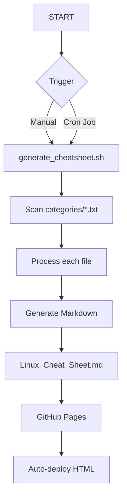

```markdown
# Linux Command Cheat Sheet Generator 🐧⚡


A Bash-powered tool that automatically generates a well-formatted Linux command cheat sheet from categorized command lists.

🔗 **Live Demo**: [Access the Cheat Sheet](https://aryansharma2206.github.io/linux-cheat-sheet/)  
📅 **Auto-updated**: Daily via cron job

## Live Site
GitHub: [Linux-Cheat-Sheet-Generator](https://aryansharma2206.github.io/linux-cheat-sheet/)

## Features ✨

- 🗂️ **Categorized Commands**: Organized by topics (Docker, systemd, networking, etc.)
- 📝 **Markdown Formatting**: Clean, readable output with consistent styling
- 🔍 **Search-Friendly**: Structured for quick command lookup
- 🤖 **Automated Generation**: Runs daily via cron job
- 🌐 **Web Accessible**: GitHub Pages hosting makes it always available
- 📱 **Responsive Design**: Works on both desktop and mobile devices

## How It Works 🔧



## Project Structure 📂

```
linux-cheat-sheet/
├── categories/          # Command category files (.txt)
├── docs/                # GitHub Pages output
│   └── index.html       # Auto-generated HTML
├── generate_cheatsheet.sh # Main generation script
└── Linux_Cheat_Sheet.md # Generated cheat sheet
```

## Installation & Usage 🛠️

### Local Setup
```bash
git clone https://github.com/AryanSharma2206/linux-cheat-sheet.git
cd linux-cheat-sheet
chmod +x generate_cheatsheet.sh
./generate_cheatsheet.sh
```

### Schedule Automatic Updates (Linux/macOS)
1. Edit crontab:
```bash
crontab -e
```
2. Add this line for daily updates at midnight:
```
0 0 * * * /path/to/linux-cheat-sheet/generate_cheatsheet.sh
```

## Customizing Commands ✏️

1. Edit or add `.txt` files in the `categories/` directory
2. Format:
```
# Command Description
command --flags
```

Example (`categories/docker.txt`):
```
# List running containers
docker ps

# Remove stopped containers
docker container prune
```

## Contributing 🤝

1. Fork the repository
2. Add/improve commands in relevant category files
3. Submit a pull request

## Roadmap 🚀

- [x] Version 1: Bash-based generator (current)
- [ ] Version 2: Flask web interface
- [ ] Add command search functionality
- [ ] Include usage examples

## 👨‍💻 Author

**Aryan Sharma**  
B.Tech CSE (AI & DS) | Poornima University  
GitHub: [@AryanSharma2206](https://github.com/AryanSharma2206)  
LinkedIn: [linkedin.com/in/aryan-sharma2206](https://www.linkedin.com/in/aryan-sharma-a2a240353/)  
Location: Jaipur, India


---

💡 **Pro Tip**: Bookmark the [live version](https://aryansharma2206.github.io/linux-cheat-sheet/) for quick access!

🐛 Found an issue? Please [open an issue](https://github.com/AryanSharma2206/linux-cheat-sheet/issues).
```

