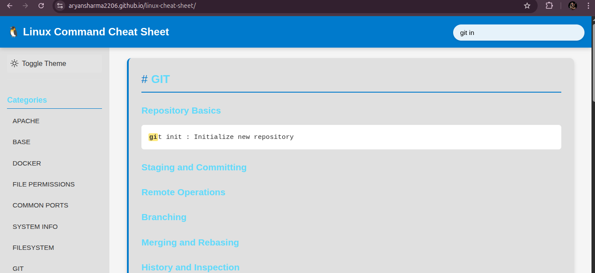
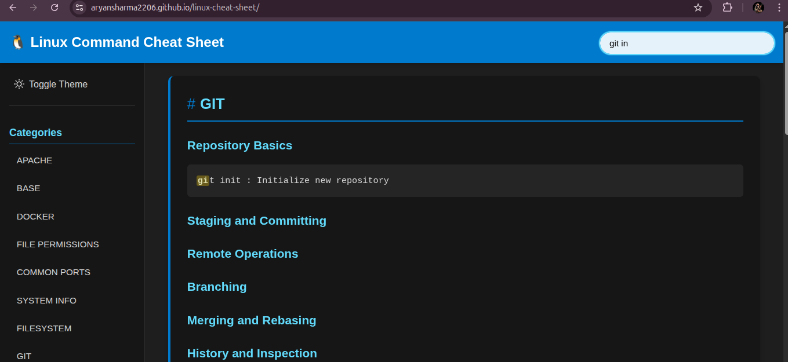
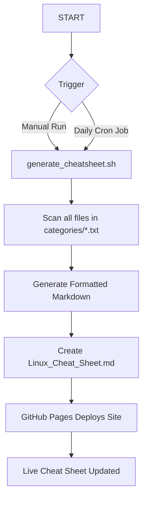

# Linux Command Cheat Sheet Generator 🐧⚡


A powerful Bash-powered tool that automatically generates a well-formatted and web-accessible Linux command cheat sheet from categorized command lists.

🔗 **Live Demo**: [**Access the Cheat Sheet Here**](https://aryansharma2206.github.io/linux-cheat-sheet-app/)

---
## ✨ Project Showcase

This project takes simple text files and turns them into a polished, searchable cheat sheet hosted on GitHub Pages.

### **1. Categorized Command Files**
The source of truth is a series of simple `.txt` files, making it easy for anyone to contribute new commands.



### **2. The Generation Script**
A Bash script reads all category files and dynamically builds the final Markdown cheat sheet.



### **3. The Final Deployed Cheat Sheet**
The generated cheat sheet is deployed as a clean, responsive webpage using GitHub Pages, perfect for quick lookups on any device.


---
## 🤖 How It Works

The entire process is automated. A Bash script is triggered (either manually or by a daily cron job), which scans the command categories, generates a comprehensive Markdown file, and pushes it to a directory that is automatically served by GitHub Pages.



---
## 📂 Project Structure
```
linux-cheat-sheet-app/
├── categories/          # Directory for command category files (.txt)
├── docs/                # Output directory for GitHub Pages
│   └── index.html       # Auto-generated HTML from Markdown
├── generate_cheatsheet.sh # The main generation script
└── Linux_Cheat_Sheet.md # The master generated cheat sheet
```

---
## 🛠️ Installation & Usage

### **Local Setup**
```bash
# Clone the repository
git clone [https://github.com/AryanSharma2206/linux-cheat-sheet-app.git](https://github.com/AryanSharma2206/linux-cheat-sheet-app.git)
cd linux-cheat-sheet-app

# Make the script executable
chmod +x generate_cheatsheet.sh

# Run the script to generate the cheat sheet
./generate_cheatsheet.sh
```

### **Schedule Automatic Daily Updates (Linux/macOS)**
To ensure the cheat sheet is always up-to-date, you can schedule the script with a cron job.

1.  Edit your crontab:
    ```bash
    crontab -e
    ```
2.  Add this line to run the script every day at midnight:
    ```
    0 0 * * * /path/to/your/project/linux-cheat-sheet-app/generate_cheatsheet.sh
    ```

---
## ✏️ How to Contribute & Customize

Adding or editing commands is incredibly simple.

1.  Choose the appropriate file in the `categories/` directory, or create a new one (e.g., `git.txt`).
2.  Add your command using the following format:
    ```
    # A brief description of the command
    your-command --with --flags
    ```

**Example (`categories/docker.txt`):**
```
# List all running Docker containers
docker ps

# Remove all stopped containers to free up space
docker container prune
```
After adding your changes, simply re-run the `./generate_cheatsheet.sh` script. If you'd like to contribute, submit a pull request!

---
## 👨‍💻 Author

**Aryan Sharma**
-   **B.Tech CSE (AI & DS)** | Poornima University
-   **Location:** Jaipur, Rajasthan, India
-   **GitHub:** [@AryanSharma2206](https://github.com/AryanSharma2206)
-   **LinkedIn:** [linkedin.com/in/aryan-sharma2206](https://www.linkedin.com/in/aryan-sharma-a2a240353/)
